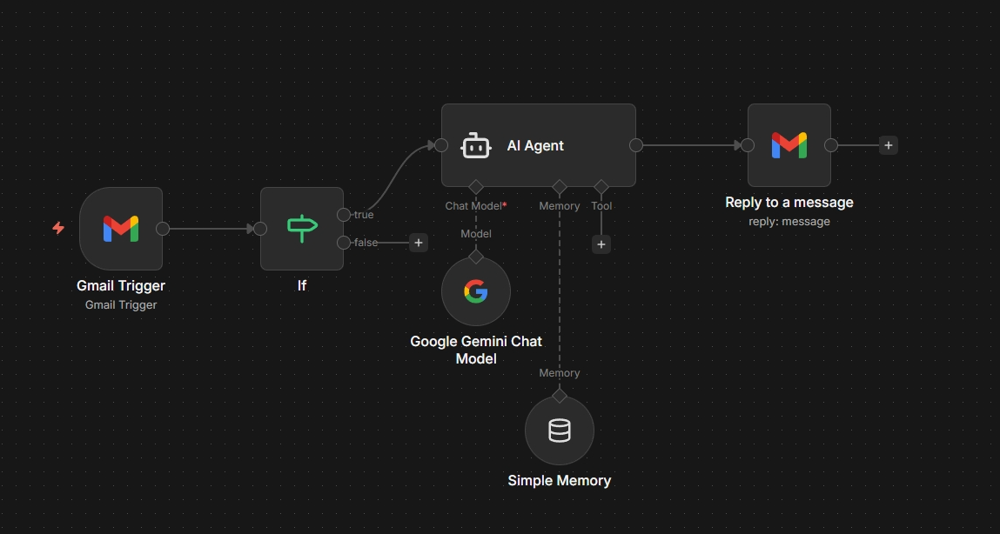

# Aula 1 - Agente de IA Comercial para Atendimento via E-mail

Este fluxo automatiza o atendimento comercial por e-mail utilizando um agente de inteligência artificial especializado em vendas de cursos online da Hashtag Treinamentos.

## Funcionamento do Fluxo

1. **Gmail Trigger**: Monitora a caixa de entrada do Gmail em tempo real (verificação a cada minuto)
2. **Filtro de Remetente**: Verifica se o e-mail recebido é do remetente específico (`jbsilva`)
3. **Agente de IA Comercial**: Processa o conteúdo do e-mail com um prompt especializado em vendas de cursos online
4. **Memória de Conversa**: Mantém o contexto da conversa usando `Simple Memory` com janela de 10 interações
5. **Resposta Automática**: Envia uma resposta personalizada ao cliente via Gmail

## Componentes Principais

- **Gmail Trigger**: Disparador que monitora novos e-mails
- **IF Condition**: Filtra mensagens do remetente específico
- **AI Agent**: Agente de inteligência artificial com prompt comercial detalhado
- **Google Gemini Chat Model**: Modelo de linguagem utilizado para processamento
- **Simple Memory**: Armazena o histórico da conversa para manter contexto
- **Reply to a message**: Envia resposta automatizada ao cliente

## Recursos do Agente Comercial

O agente é especializado em responder perguntas frequentes sobre:
- Cursos disponíveis (Excel, Power BI, Python, IA, JavaScript, etc.)
- Informações sobre a empresa e confiabilidade
- Eventos gratuitos e comunidade impressionadora
- Ementas e detalhes dos cursos
- Preços e condições de pagamento

## Arquivos do Projeto

- **Workflow JSON**: [Agentes de IA Aula 1.json](./Arquivos/Agentes%20de%20IA%20Aula%201.json)
- **Prompt Comercial**: [Prompt IA Comercial.docx](./Arquivos/Prompt%20IA%20Comercial.docx)

## Configuração Requerida

Para funcionar corretamente, este fluxo requer:
- Conta do Gmail configurada com credenciais OAuth2
- Chave da API do Google Gemini (PaLM)
- Permissões adequadas para leitura/envio de e-mails

