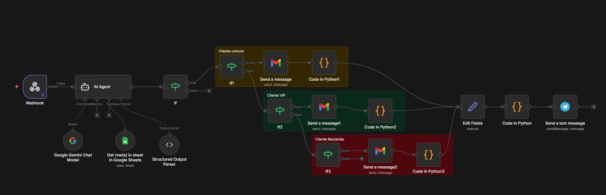

# Agente de IA - Aula 2

Nesta aula foi desenvolvido um fluxo automatizado para processar solicitações de reembolso através de um formulário web. O fluxo inclui:

- Gatilho via webhook para capturar respostas do formulário
- Processamento das respostas pelo agente de IA
- Consulta a uma planilha online (Google Sheets) para obter dados do cliente
- Análise de sentimento do comentário do cliente
- Classificação do cliente com base em critérios definidos
- Envio de respostas personalizadas por e-mail de acordo com o tipo de cliente
- Envio de alertas para um canal do Telegram

## Detalhes do Fluxo

1. **Recebimento dos dados**: Um webhook recebe os dados do formulário de reembolso
2. **Processamento pela IA**: O agente de IA extrai informações e faz análise de sentimento
3. **Consulta à base de dados**: Consulta a planilha de clientes para obter informações adicionais
4. **Classificação**: Os clientes são classificados como:
   - Cliente comum (menos de 3000 reais gastos e sentimento não muito negativo)
   - Cliente VIP (3000 reais ou mais gastos)
   - Cliente reclamão (sentimento muito negativo)
5. **Respostas personalizadas**: Envio de e-mails diferentes conforme a classificação
6. **Notificações**: Envio de alertas para o Telegram com detalhes das interações

## Arquivos Relacionados

- [Planilha de Clientes](./Arquivos/Aula%202%20Imersão%20-%20Base%20Clientes.xlsx)
- [Arquivo JSON do Fluxo](./Arquivos/Agente%20de%20IA%20Aula%202.json)
- [Prompts Utilizados](./Arquivos/Prompt%20Agente%20de%20IA.docx)
- [Respostas dos Clientes](./Arquivos/Respostas%20Clientes.docx)
- [Mensagens do Telegram](./Arquivos/Mensagens%20Telegram.docx)

