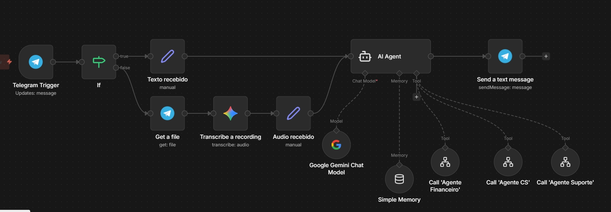

# Sistema de Agentes de Atendimento - Aula 3

Nesta aula foi desenvolvido um sistema completo de atendimento automatizado composto por 4 agentes especializados que trabalham em conjunto para oferecer suporte aos clientes da Hashtag Capital.

## Componentes do Sistema

### Agente Gerente ([Ver JSON](./Arquivos/Agente%20Gerente.json))
- Monitora um bot do Telegram para receber mensagens
- Recebe tanto textos quanto áudios (com transcrição automática via Google Gemini)
- Atua como roteador inteligente, identificando a intenção do cliente e encaminhando para o subagente adequado
- Retorna as respostas dos subagentes diretamente ao cliente no Telegram
- Mantém contexto da conversa usando memória de buffer

### Subagentes Especializados

#### Agente Financeiro ([Ver JSON](./Arquivos/SubAgentes/Agente%20Financeiro.json))
- Especialista em questões financeiras e operacionais
- Consulta status de pagamentos e débitos dos clientes em planilha online
- Gera segunda via de boletos e orienta sobre regularização de pagamentos
- Trabalha com empatia e foco na solução, atuando como parceiro de negócios

#### Agente de Suporte ([Ver JSON](./Arquivos/SubAgentes/Agente%20suporte.json))
- Especialista técnico e tutor financeiro
- Responde dúvidas conceituais sobre produtos financeiros (CDB, Ações, FIIs, Tesouro, etc.)
- Explica como funcionam os investimentos sem fazer recomendações de compra
- Atua com didática e segurança técnica

#### Agente de Customer Success (CS) ([Ver JSON](./Arquivos/SubAgentes/Agente%20CS.json))
- Especialista em relacionamento e agendamento
- Realiza triagem para entender o momento do cliente
- Agenda reuniões de revisão de carteira e novos aportes
- Integra com Google Calendar para confirmação automática de reuniões

## Funcionalidades Avançadas

- **Transcrição de Áudio**: Mensagens de voz são automaticamente convertidas em texto
- **Memória de Conversa**: Manutenção do contexto para respostas mais coesas
- **Roteamento Inteligente**: Distribuição automática para o especialista correto
- **Integração com Ferramentas**: Conexão com Google Sheets e Google Calendar
- **Tratamento de Erros**: Sistema robusto com fallbacks para casos complexos

## Arquitetura do Sistema

O sistema utiliza uma arquitetura de agentes hierárquicos onde o Agente Gerente coordena os subagentes especializados, criando uma experiência de atendimento integrada e eficiente.

## Documentação Adicional

- [Prompts dos Agentes](./Arquivos/Prompts%20Agentes.docx)

