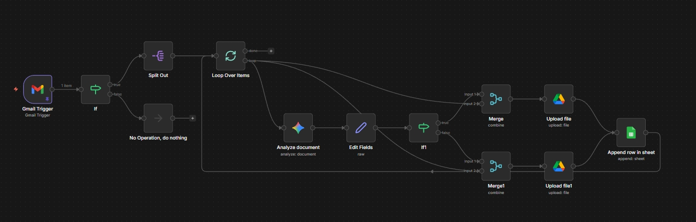

# Sistema Automatizado de Processamento de Faturas - Aula 4

Este fluxo automatiza o processamento de faturas recebidas por e-mail, utilizando inteligência artificial para extrair e organizar dados importantes.

## Funcionalidades

- **Monitoramento de E-mail**: Verifica automaticamente a caixa de entrada do Gmail por novas mensagens com anexos
- **Detecção de Anexos**: Identifica automaticamente se os e-mails possuem anexos em formato PDF
- **Processamento em Lote**: Separa múltiplos anexos e processa cada um individualmente em loop
- **Extração de Dados via IA**: Utiliza o modelo Google Gemini 2.5 Flash para analisar os PDFs e extrair informações estruturadas
- **Classificação Automática**: Separa faturas corporativas de pessoais com base no conteúdo
- **Organização de Arquivos**: Salva os documentos processados em pastas específicas no Google Drive
- **Registro em Planilha**: Insere automaticamente os dados extraídos em uma planilha online do Google Sheets

## Campos Extraídos

O sistema extrai automaticamente as seguintes informações das faturas:
- Data da fatura
- Fornecedor
- Valor
- Moeda
- Impostos
- Número da fatura
- Categoria
- Tipo (corporativo/pessoal)
- Método de pagamento
- Nome sugerido para o arquivo

## Estrutura do Processo

1. **Gatilho**: Novo e-mail recebido no Gmail
2. **Verificação**: Confirmação de existência de anexos PDF
3. **Separação**: Divisão de múltiplos anexos para processamento individual
4. **Análise por IA**: Extração de dados usando modelo de linguagem avançado
5. **Decisão**: Classificação como corporativo ou pessoal
6. **Armazenamento**: Upload organizado para pastas específicas no Google Drive
7. **Registro**: Inserção de dados na planilha de controle

## Recursos Utilizados

- [Modelos de Faturas](./Arquivos/Invoices/)
- [Planilha de Controle Online](./Arquivos/Faturas%20Recebidas.xlsx)
- [Prompt Utilizado](./Arquivos/Prompt%20Agente.docx)

## Download do Fluxo

O fluxo completo pode ser baixado [aqui](./Arquivos/Agente%20de%20IA%20-%20Aula%204.json)

